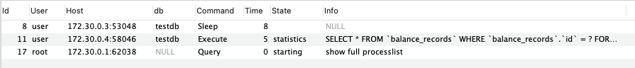
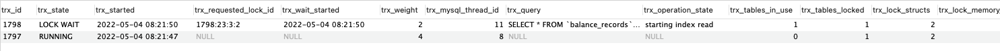
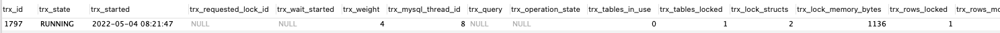

# MySQL 1205 Error 實驗

## Lock wait timeout exceeded; try restarting transaction

這個error主要出現在client side，當嘗試存取一個被其他transaction持有的row lock時 ，而嘗試存取的等待時間超過上限後，即會回傳該error。

這個超時預設值為50秒。

[Ref](https://dev.mysql.com/doc/refman/5.7/en/innodb-parameters.html#sysvar_innodb_lock_wait_timeout)


## 發生情形

1. 多個transaction先後對同一條資料進行插入和更新操作
2. 瞬時出現高併發流量
3. 或是持有row lock的transaction持有太久，沒有rollback或是commit


## 實驗方式

使用兩個process，其中第一個process在transaction過程中加入sleep，強制使transacation過程拉長，模擬transaction過程中出現一些未知長時間操作。而第二個process則是在第一個process執行後，再嘗試獲取行鎖，因為鎖未被釋放，等待時間超過上限後，就會爆出1205 Error。


## 執行

``` bash
make run
```


## 結果輸出

看一下db上資料。



以及transaction狀態，一個是運行中，一個是等待lock中。



過了50秒後，process 2出現了目標錯誤，如下圖。

``` txt
normal_app_1    | 2022/05/04 08:21:50 start normal transaction
normal_app_1    |
normal_app_1    | 2022/05/04 08:22:41 /repo/main.go:69 Error 1205: Lock wait timeout exceeded; try restarting transaction
normal_app_1    | [51056.832ms] [rows:0] SELECT * FROM `balance_records` WHERE `balance_records`.`id` = 1 FOR UPDATE
normal_app_1    | 2022/05/04 08:22:41 normal app failed to commit:  Error 1205: Lock wait timeout exceeded; try restarting transaction
normal_app_1    | 2022/05/04 08:22:41 app finished
mysql-1205-error_normal_app_1 exited with code 0
```


## 如何手動排除

如果判定是異常行為，或是程式本身的bug，我們可以藉由指令將佔著資源的程序手動刪除。

先查詢一下目前mysql內有哪些執行緒正在進行中

````sql
show full processlist;
````


接下來我們可以查詢一下有哪些transaction正在進行當中，

```sql
select * from information_schema.innodb_trx;
```



可以看到1797這個transaction的trx_mysql_thread_id對應到上個指令的process list ID 8。

我們手動砍掉這個執行緒，輸入以下指令，

```sql
kill 8;
```

這會導致原本持有lock的process進行commit時失敗，如下log。

``` txt
blocking_app_1  | 2022/05/04 08:21:47 start blocking transaction
blocking_app_1  | 2022/05/04 08:24:47 blocking app failed to commit:  driver: bad connection
blocking_app_1  | 2022/05/04 08:24:47 app finished
mysql-1205-error_blocking_app_1 exited with code 0
```

這時後續的process嘗試存取row lock就會正常了。

``` txt
2022/05/04 08:25:27 start normal transaction
2022/05/04 08:25:27 app finished
```


## 附註

在process 1內只在transaction內sleep了3分鐘，操作以上查詢和刪除的行為手速要快，不然transaction時間到了就會自行完成，並釋放鎖。