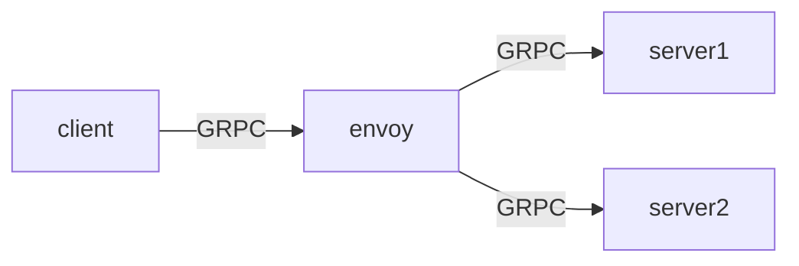

# GRPC Load Balance with Envoy

## 前言

GRPC基於HTTP2的協定下，是不像HTTP1那麼容易做到負載平衡，畢竟HTTP2的特性是會維持連線，並藉由該連線發送多個request，因此即使藉由連線的負載平衡使多個連線連到不同的後端伺服器 時，也會因為連線間的流量不一致，導致伺服器的負載不平衡。

因此本範例中展示如何設定一個服務集群中讓GRPC流量合理導到不同伺服器。

## 方法

其實GRPC負載平衡的做法很多，如客戶端去做，或是伺服器端，不過為了統一管理方便，我們選擇在後端設定好平衡的邏輯。在本次範例我們採用的方法是在後端服務前加上一個代理伺服器，藉由該代理伺服器將我們GRPC流量轉發到不同的服務節點當中。我們使用[envoy](https://www.envoyproxy.io/)來做為我們的解決方案，envoy本身是支援 HTTP/2 的 LB 功能。

**envoy設定**

很重要的地方是在設定envoy的service discovery時，我們採用了STRICT DNS策略，該策略是持續的解析目標domain name，並將所有的dns查詢到的IP作為上游集群中可用的host，在後續的request分發中會使用這些IP來做負載平衡，如採用Round robin或是Least Request等[策略](https://cloudnative.to/envoy/api-v2/api/v2/cluster.proto.html?highlight=round_robin#enum-cluster-lbpolicy)。

## 架構




## 範例

**項目**

1. 服務在docker-compose集群中的負載平衡
2. 服務在k8s集群中的附載平衡

### 服務在docker-compose集群中的負載平衡

**說明**

在docker-compose環境，查詢server docker dns會回復兩個docker network內的IP，分別對應到兩個server container，envoy藉由這兩個IP去進行LB。

**執行**

在terminal中輸入

``` bash
make docker-cluster
make docker-test
```

**輸出**

``` txt
map[d129540c-ce0f-4d7a-a8b4-ecdd435d4c40:33 ec83a63b-a600-4486-85d4-f945a98058c0:34 f119163f-0fb2-482e-9626-5a3f6eb784ac:33]
```

### 服務在k8s集群中的負載平衡

**說明**

在k8s環境中，我們為server建立了一個[headless](https://kubernetes.io/docs/concepts/services-networking/service/#headless-services) service，主要效果是讓envoy在查詢`server`這個domain name時，可以讓kube-dns回傳的是endpoint list（pod A Record），而不是回傳service的cluster IP，進而避免經由k8s平台來做LB（L4 LB）。

**執行**

在terminal中輸入

``` bash
make k8s-cluster
make k8s-export
```

開啟另一個terminal，並輸入

``` bash
make k8s-test
```

**輸出**

``` txt
map[3108326a-83e1-498b-bb6c-cc1da017e484:33 44775c38-d7e8-4f84-8818-59f0f856b77a:33 ed363094-39ac-4087-bfe3-3b14f6a50615:34]
```

**比較**

刪除k8s.yaml中，server service的`clusterIP: None`欄位，並重新執行上述步驟

## 參考

1. [k8s service](https://kubernetes.io/docs/concepts/services-networking/service)
2. [envoy service discovery](https://www.envoyproxy.io/docs/envoy/latest/intro/arch_overview/upstream/service_discovery)
3. [矽谷牛的耕田筆記](https://telegra.ph/Envoy-as-a-gRPC-Load-Balancer-in-Kubernetes-09-30)
4. [小信豬的原始部落](https://godleon.github.io/blog/Kubernetes/k8s-Service-Overview/)
