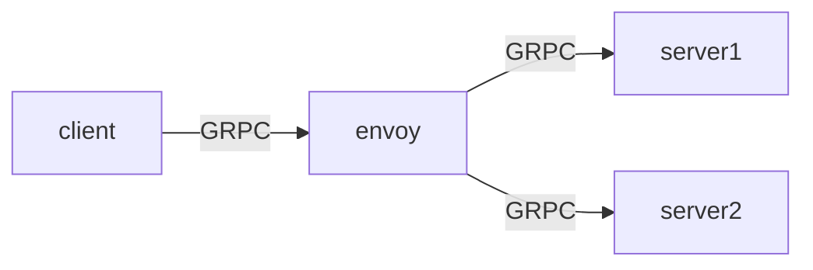

# GRPC 疑難雜症 - missing content-type field

###### tags: `GRPC`

> 本篇並沒有找出root cause，不過提供了一個暫時的解決辦法。

## 問題點
在進行GRPC上游滾動部署時，發現下游服務呼叫上游GRPC服務時會出現以下錯誤訊息
> rpc error: code = Unknown desc = OK: HTTP status code 200; transport: missing content-type field


## 環境
在server和client中間我們有加上envoy作為LB，並且整個服務是運作在k8s cluster當中


## 分析
1. 追蹤至[grpc transport http_util.go](https://github.com/grpc/grpc-go/blob/daba80583807e692013f3fd884092e77413705f1/internal/transport/http_util.go#L283)
2. 得出結論是frame當中缺少了content type欄位
3. 這個decodeHeader有兩個進入點，分別是[server](https://github.com/grpc/grpc-go/blob/v1.37.0/internal/transport/http2_server.go#L310)和[client](https://github.com/grpc/grpc-go/blob/v1.37.0/internal/transport/http2_client.go#L1249)，因此我們需要測試是server端報錯還是client端報錯

## 實驗
具體會發生上述錯誤的地方有兩點，一是server side 讀取http2 frame內容，二是grpc client side 讀取frame時，我們在grpc lib裡面加入log並且reproduce錯誤流程(刪除pod或是deploy皆可)。

**步驟**
1. 修改 grpc lib，**打印frame name和frame value**
2. 啟動server
3. 啟動client，連續發送request給server端
4. 終止server
5. 觀察client side log紀錄

會發現是client side報錯了，錯誤的frame內容如以下所示
```
name :status value 200
name content-length value 0
name data value Tue, 22 Mar 2022 09:36:25 GMT
name x-envoy-upstream-service-time value 0
name server value envoy
```


確實可以發現少了content-type的欄位

而除了中間有envoy的架構，我們直接用client透過`service`直連server，並且重複步驟3-5，也可以發現同樣的錯誤，所以也可以排除是中間LB的關係。

```
name :status value 200
name content-length value 0
name data value Wed, 23 Mar 2022 07:22:36 GMT
```

## 結論
針對這個問題，我們在client端加入retry來避開部署過程中的server短暫失效的錯誤。

``` go
retryOpts := []grpc_retry.CallOption{
		grpc_retry.WithCodes([]codes.Code{codes.ResourceExhausted, codes.Unavailable, codes.Unknown}...),
		grpc_retry.WithMax(3),
		grpc_retry.WithBackoff(grpc_retry.BackoffExponential(100 * time.Millisecond)),
	}

	var tlsConf tls.Config
	c := credentials.NewTLS(&tlsConf)
	return []grpc.DialOption{
            grpc.WithTransportCredentials(c),
            grpc.WithBlock(),
            grpc.WithUnaryInterceptor(grpc_retry.UnaryClientInterceptor(retryOpts...)),
		
	}
```
